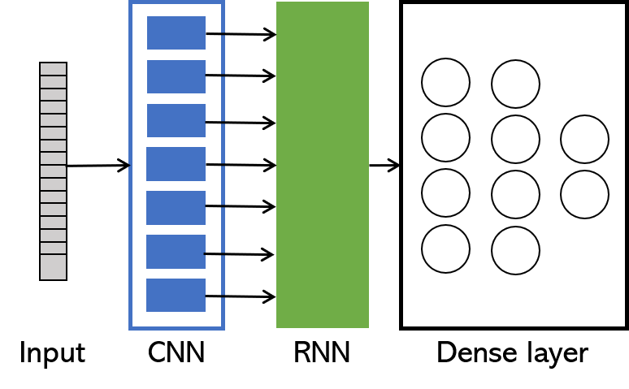

\newpage

```{r setup, include = FALSE, eval = TRUE}
knitr::opts_chunk$set(echo = FALSE, eval = TRUE, fig.height = 4)

# SLoading libraries to use
library(tidyverse)
library(scales)
library(grid)
library(kableExtra)
library(latex2exp)

# Loading data to use
models_name <- tibble(cnn_layer = c("inception", "inception_resnet", "resnet101", "resnet152", "resnet50"),
                      cnn_name = c("Inception V3", "Inception ResNet V2", "ResNet 101V2", "ResNet 152V2", "ResNet 50V2"))


data <- read_csv("data/train.csv",
         col_types = cols(
             .default = col_double(),
             cnn_layer = col_character()
             )) %>% 
    mutate_if(is_double, lead) %>% 
    filter(!is.na(loss)) %>% 
    filter(cnn_layer != "resnet152") %>% 
    group_by(cnn_layer) %>% 
    mutate(epoch = row_number()) %>% 
    ungroup() %>% 
    left_join(models_name, by = "cnn_layer") %>% 
    select(cnn_name, epoch, loss, val_loss, acc, val_acc) %>% 
    rename(cnn_layer = cnn_name) %>% 
    mutate(description = if_else(epoch <= 50, "CNN Freeze", "CNN fine tuning"))

rect_tbl <- tibble(xmin = 51,
                   xmax = 60,
                   ymin = -Inf,
                   ymax = Inf,
                   epoch = 0)
```

# Introduction

Humans use gestures and body movements to comunicate certan information in a nonverbal mechanism. Emotios are a part of human behavior and the facial expressions and body movement can be as part of a deliberate action or subconsciously revealing intentions or attitude [@Escalera01].

Nowadays, with the rise of the computer vision, the develop of clasification algorithms for images had been productive. Some examples of those algorithms are facenet [@facenet], resnet [@resnet], inceptionV3 [@inception3] or YOLOv3 [@yolo3]. The accuracy of this algorithms is helping business to implementedd in their process in order to reduce costs or add an extra layer of analisys and quality.

With the advance in deep learning techniques some companies had begun to explore and develop more complicated algorithms for Autonomous Driving.In this case, it is not only the image recognition an important part but also the sequence of the actions along with the objects detected that need to be implemented.

So, we asked ourselves about the state of the art for emotions and body gesture recognition. In this case, a single image is not enough because not all the expresions are fully explicit and require sequences of certain actions to identify them. Along with that, the human emotions are subjectives and even humans are not capables to read all of them correclty.

The capacity to build an architecture and train a model to classify the emotions of the persons throught the body gesture can be an excellent asset asset for companies where the customer service is a priority and get the ability of identify when the client is not happy. But the applications of this kinds of systems is not limited to this. The objetive of this work is to understand what are the advances made in this area.


# Literature Review

@Noroozi01 made an study analizing multiples studies and identified that gestures can be classified in intrinsic, extrinsic and a result of natural selection. Also, they mention that body language has a lot of information about emotions. Through the survey, @Noroozi01 identified that face is the principal source of information to identify emotions, but hands and head position are very rich in the body language and can help to increase accuracy in the classification. Those ideas are the base of the two main models to analyze emotional body gesture.

The first model has focus the human body where studies like @Bernhardt01 and @Wu07 analyzed from a spatio-temporal movement structures and considering that some expressions are not additives; like walk and eat at the same time. In order to solve this problems, some researches tried to use two different approachs; part based models and kinematics models.

Part based models try to model the human body as independent parts and then use compositional rules to model the gestures. While, kinematic models tries to simplify the human body as a cyclical tree graphs to infer gestures. The principal problem about those approachs, for this project, is that can't model emotions.

On the other hand, there are models that try to detect emotions throught three main categories [@Kolakowska01]. The first approach is called categorical model and it tries to classify emotions under the assumption that humans have universal expressions like happiness and sadness [@Ekman01; @Ekman02]. The second approach is the dimensional model and the objective is to try to classify emotions using latent dimensions, but the continuous nature of this approach is very complex due to the high number of dimensions. Last, the thirds approach is the componential model and its main idea is to solve the problem using a mix of the two previous models, its hypotesis is that exist primary emotions, like happines or sadnes, that are the base for more complex ones.


# Metodology

All the code created to run the experiemnts is in the repository [gesture-recognition](https://github.com/DQsamayoa/gesture-recognition). The sctructure of the repository is as follow:

```bash
gesture-recognition/
+-- report/
|   +-- imgs/
|   +-- tex/
|   +-- report.rmd
+-- train_model/
|   +-- __init__.py
|   +-- model_utils.py
+-- .gitignore
+-- environment.yml
+-- run_experiment.py
```

- **report**: It is the folder with all the files, images and configuration to create this report in PDf using Rmarkdown
- **train_model**: It is the folder with the script with the classes created in python to help us with the reproducibility of the experiments
- **environment.yml**: YAML file with all the python's libraries to create a conda environment to build and train the models
- **run_experiment.py**: A python's script with all the code to iterate the experiments to test different hyperparameters

To the previous folder, it is needed to add a **videos** folder with the follow structure:

```bash
videos
+-- folder_category_01
|   +-- file_videoA
|   +-- file_videoB
|   +-- ...
+-- folder_category_02
|   +-- file_videoA
|   +-- file_videoB
|   +-- ...
+-- folder_category_03
|   +-- file_videoA
|   +-- file_videoB
|   +-- ...
+-- ...
```

this is because the script will take the classes' name from the inner folders and the videos from each category.

## Dataset

We decided to use the dataset [HMDB](https://serre-lab.clps.brown.edu/resource/hmdb-a-large-human-motion-database/) created by @dataset01 since we identify as a reference dataset at the moment of evaluation of algorithms. This dataset has 6,849 videoclips divided into 51 action categories.

Since the dataset doesn't have all the action categories that we would like to analyze (e.g. anger, sadness, fear, surprise, happines, etc.), ee decided to use only seven categories that are related to the actions that we are interested:

- clap
- eat
- laugh
- pick
- smile
- talk
- wave

In this case we decided to use 66% of the videos to train and 33% for validation. So, the number of videos was:

| Category | Train | Validation |
| :---: | :---: | :---: |
| clap   | 88 | 42 |
| eat | 73 | 35 |
| laugh | 86 | 42 |
| pick | 72 | 34 |
| smile | 69 | 33 |
| talk | 81 | 39 |
| wave | 70 | 34 |
| --- | --- | --- |
| Total | 539 | 259 |

## Architecture

The architecture decided to build the model was the follow:

1. Input: Frames extracted from the videos
2. CNN: Convolutional neural network used the number of times equal as the number of frames used for Inputs
3. RNN: Recurrent neural network to process the feature characteristics created by the CNN layer and preserving the order of the frames
4. Dense layer: A dense layer to receive the recurrent layer output to process and trying to use to classify the video with a softmax output



We also, decided to use transfer learning to take adbantage of convolutional models already trained. For this, we decided to use just a sample of the multiples ones that already exists:

- InceptionV3
- Inception-resnetV2
- Resnet101V2
- Resnet152V2
- Resnet50V2

For this architechture we have the next hyperparameters for tunning:

- Input:
    - Number of frames
- CNN layer:
    - Pretrained convolutional network
    - Number of layers to freeze
- RNN layer:
    - Type of recurrent neural network: GRU or LSTM
    - All the parameters like: units, activation, recurrent activation, etc.
- Dense layer:
    - Number of hiden layers
    - Number of neurons in each layer
    - Activation for each hidden layer
    - Regularization

In order to build this architecture, the script `model_utils.py` was created to control all the architecture and make sure of the correct build in each experiment.

## Trainning

In order to reduce the amount of time for trainning, we decided to take a subset of the hyperparameters space. In this case the elements considered to test were:

- **Inputs**
    - Number of frames used to train the model: 25 and 50.
- **CNN layer**
    - The pretrained convolutional network: InceptionV3, Inception-resnetV2, Resnet101V2, Resnet152V2, Resnet50V2
    - Freeze all the convolutional networks first and train the weights for the others layers
    - Do a fine tunning after the weights for the last 50 convolutional layers
- **RNN layer**:
    - Only use a LSTM layer
    - Number of units: 64 and 128
- **Dense layer**
    - Use relu as activation for all the hidden layers
    - Use the follow architectures:
        - (128, 64): Two hidden layers, one with 128 neurons and the other with 64
        - (128, 128, 64, 64): Four hidden layers, two with 128 neurons and two with 64
    - Use ridge regularization.
- **Optimizer**
    - The optimizer used in all the trainnings was Adam, but we modify the betas parameters and the epsilon in order to see their effects in the training.
```python
tf.keras.optimizers.Adam(
    learning_rate=0.001, beta_1=0.9, beta_2=0.999, epsilon=1e-07, amsgrad=False,
    name='Adam', **kwargs
)
```
  
The previous considerations give us a hyperparameter space with 64 elements. The steps taken to train the model was as follow:

1. Select a convolutional layer from the list
2. Build a model full architecture as showed
3. Freeze all the convolutional layer
4. Train the weights from the recurrent and dense layer (50 epochs)
5. Unfreeze the last 50 layers of the convolutional layer
6. Train all the model with an Adam optimizer with a very low learning rate (5 epochs)
7. Repeate the process with different hyperparameter

# Results

```{r}
data %>% 
  group_by(cnn_layer) %>% 
  filter(epoch == max(epoch)) %>% 
  select(cnn_layer, ends_with("loss"), ends_with("acc")) %>% 
  knitr::kable(format = "latex", booktabs = TRUE, longtable = TRUE, linesep = "", digits = 3, 
               caption = "Training results per model",
               col.names = c("Convolutional layer", "Train", "Validation", "Train", "Validation")) %>% 
  add_header_above(c("", "Loss" = 2, "Accuracy" = 2)) %>% 
  row_spec(0, align = "c") %>% 
  kableExtra::kable_styling(latex_options = c("striped", "repeat_header"))
```


```{r, fig.height = 10}
data %>% 
    rename(train_loss = loss,
           train_acc = acc) %>% 
    gather("type_loss", "loss", train_loss, val_loss) %>% 
    ggplot() +
    geom_rect(aes(xmin = xmin, xmax = xmax, ymin = ymin, ymax = ymax),
              fill = "slateblue", alpha = 0.3, data = rect_tbl) +
    annotate("text", x = 55.5, y = 4, label = "CNN fine\ntunning") +
    geom_line(aes(x = epoch, y = loss, color = type_loss), size = 1) +
    scale_color_manual(values = c("chocolate1", "steelblue"), labels = c("Train", "Validation")) +
    facet_wrap(vars(cnn_layer), ncol = 1, strip.position = "top") +
    labs(title = "Loss per epoch",
         x = "Epoch",
         y = "Loss",
         color = "Type") +
    theme_bw() +
    theme(plot.title = element_text(hjust = 0.5, size = 18),
          axis.title = element_text(size = 12),
          legend.text = element_text(size = 12),
          strip.text = element_text(size = 12),
          legend.position = "right")
```

```{r, fig.height = 10}
data %>% 
    rename(train_loss = loss,
           train_acc = acc) %>% 
    gather("type_acc", "accuracy", train_acc, val_acc) %>% 
    ggplot() +
    geom_rect(aes(xmin = xmin, xmax = xmax, ymin = ymin, ymax = ymax),
              fill = "slateblue", alpha = 0.3, data = rect_tbl) +
    annotate("text", x = 55.5, y = 0.3, label = "CNN fine\ntunning") +
    geom_line(aes(x = epoch, y = accuracy, color = type_acc), size = 1) +
    scale_color_manual(values = c("chocolate1", "steelblue"), labels = c("Train", "Validation")) +
    facet_wrap(vars(cnn_layer), ncol = 1, strip.position = "top") +
    labs(title = "Accuracy per epoch",
         x = "Epoch",
         y = "Accuracy",
         color = "Type") +
    theme_bw() +
    theme(plot.title = element_text(hjust = 0.5, size = 18),
          axis.title = element_text(size = 12),
          legend.text = element_text(size = 12),
          strip.text = element_text(size = 12),
          legend.position = "right")
```


# Summary

# Apendix

# References
